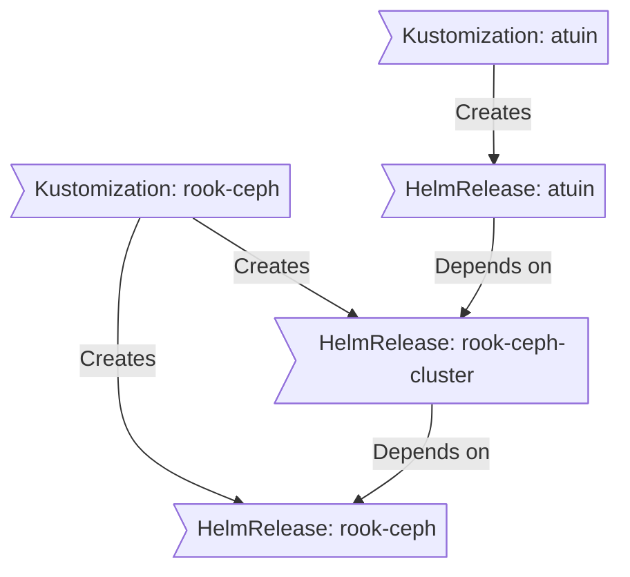

<div align="center">


###  My Home Operations Repository 

_... managed with Flux, Renovate, and GitHub Actions_ 

</div>

<div align="center">

[](https://discord.gg/home-operations)&nbsp;&nbsp;
[](https://talos.dev)&nbsp;&nbsp;
[](https://kubernetes.io)&nbsp;&nbsp;
[](https://fluxcd.io)&nbsp;&nbsp;
[](https://github.com/caycehouse/home-ops/actions/workflows/renovate.yaml)

</div>

<div align="center">

[](https://status.housefam.casa)&nbsp;&nbsp;
[](https://status.housefam.casa)&nbsp;&nbsp;
[](https://status.housefam.casa)

</div>

<div align="center">

[](https://github.com/kashalls/kromgo)&nbsp;&nbsp;
[](https://github.com/kashalls/kromgo)&nbsp;&nbsp;
[](https://github.com/kashalls/kromgo)&nbsp;&nbsp;
[](https://github.com/kashalls/kromgo)&nbsp;&nbsp;
[](https://github.com/kashalls/kromgo)&nbsp;&nbsp;
[](https://github.com/kashalls/kromgo)&nbsp;&nbsp;
[](https://github.com/kashalls/kromgo)

</div>

---

##  Overview

This is a mono repository for my home infrastructure and Kubernetes cluster. I try to adhere to Infrastructure as Code (IaC) and GitOps practices using tools like [Kubernetes](https://kubernetes.io/), [Flux](https://github.com/fluxcd/flux2), [Renovate](https://github.com/renovatebot/renovate), and [GitHub Actions](https://github.com/features/actions).

---

##  Kubernetes

My Kubernetes cluster is deployed with [Talos](https://www.talos.dev). This is a semi-hyper-converged cluster, workloads and block storage are sharing the same available resources on my nodes while I have a separate server with ZFS for NFS/SMB shares, bulk file storage and backups.

There is a template over at [onedr0p/cluster-template](https://github.com/onedr0p/cluster-template) if you want to try and follow along with some of the practices I use here.

### Core Components

- [actions-runner-controller](https://github.com/actions/actions-runner-controller): Self-hosted Github runners.
- [cert-manager](https://github.com/cert-manager/cert-manager): Creates SSL certificates for services in my cluster.
- [cilium](https://github.com/cilium/cilium): eBPF-based networking for my workloads.
- [cloudflared](https://github.com/cloudflare/cloudflared): Enables Cloudflare secure access to my routes.
- [external-dns](https://github.com/kubernetes-sigs/external-dns): Automatically syncs ingress DNS records to a DNS provider.
- [external-secrets](https://github.com/external-secrets/external-secrets): Managed Kubernetes secrets using [1Password Connect](https://github.com/1Password/connect).
- [multus](https://github.com/k8snetworkplumbingwg/multus-cni): Multi-homed pod networking.
- [rook](https://github.com/rook/rook): Distributed block storage for peristent storage.
- [sops](https://github.com/getsops/sops): Managed secrets for Kubernetes and Terraform which are commited to Git.
- [spegel](https://github.com/spegel-org/spegel): Stateless cluster local OCI registry mirror.
- [volsync](https://github.com/backube/volsync): Backup and recovery of persistent volume claims.

### GitOps

[Flux](https://github.com/fluxcd/flux2) watches the clusters in my [kubernetes](./kubernetes/) folder (see Directories below) and makes the changes to my clusters based on the state of my Git repository.

The way Flux works for me here is it will recursively search the `kubernetes/apps` folder until it finds the most top level `kustomization.yaml` per directory and then apply all the resources listed in it. That aforementioned `kustomization.yaml` will generally only have a namespace resource and one or many Flux kustomizations (`ks.yaml`). Under the control of those Flux kustomizations there will be a `HelmRelease` or other resources related to the application which will be applied.

[Renovate](https://github.com/renovatebot/renovate) watches my **entire** repository looking for dependency updates, when they are found a PR is automatically created. When some PRs are merged Flux applies the changes to my cluster.

### Directories

This Git repository contains the following directories under [Kubernetes](./kubernetes/).

```sh
📁 kubernetes
├── 📁 apps       # applications
├── 📁 components # re-useable kustomize components
└── 📁 flux       # flux system configuration
```

### Flux Workflow

This is a high-level look how Flux deploys my applications with dependencies. In most cases a `HelmRelease` will depend on other `HelmRelease`'s, in other cases a `Kustomization` will depend on other `Kustomization`'s, and in rare situations an app can depend on a `HelmRelease` and a `Kustomization`. The example below shows that `atuin` won't be deployed or upgrade until the `rook-ceph-cluster` Helm release is installed or in a healthy state.



### Networking

<details>
  <summary>Click here to see my high-level network diagram</summary>

  
</details>

---

##  Cloud Dependencies

While most of my infrastructure and workloads are self-hosted I do rely upon the cloud for certain key parts of my setup. This saves me from having to worry about three things. (1) Dealing with chicken/egg scenarios, (2) services I critically need whether my cluster is online or not and (3) The "hit by a bus factor" - what happens to critical apps (e.g. Email, Password Manager, Photos) that my family relies on when I no longer around.

Alternative solutions to the first two of these problems would be to host a Kubernetes cluster in the cloud and deploy applications like [HCVault](https://www.vaultproject.io/), [Vaultwarden](https://github.com/dani-garcia/vaultwarden), [ntfy](https://ntfy.sh/), and [Gatus](https://gatus.io/); however, maintaining another cluster and monitoring another group of workloads would be more work and probably be more or equal out to the same costs as described below.

| Service                                         | Use                                                               | Cost           |
|-------------------------------------------------|-------------------------------------------------------------------|----------------|
| [1Password](https://1password.com/)             | Secrets with [External Secrets](https://external-secrets.io/)     | ~$65/yr        |
| [Cloudflare](https://www.cloudflare.com/)       | Domain and S3                                                     | ~$40/yr        |
| [GitHub](https://github.com/)                   | Hosting this repository and continuous integration/deployments    | Free           |
| [Pushover](https://pushover.net/)               | Kubernetes Alerts and application notifications                   | $5 OTP         |
| [UptimeRobot](https://uptimerobot.com/)         | Monitoring internet connectivity and external facing applications | Free           |
|                                                 |                                                                   | Total: ~$9/mo  |

---

##  DNS

In my cluster there are three instances of [ExternalDNS](https://github.com/kubernetes-sigs/external-dns) running. One for syncing private DNS records to my `UDM Pro` using [ExternalDNS webhook provider for UniFi](https://github.com/kashalls/external-dns-unifi-webhook), while the other two instances sync public DNS to `Cloudflare`. This setup is managed by creating ingresses with three specific classes: `internal` for private DNS, `external` for public DNS (tunneled), and `ipv4` for public DNS (non-tunneled). The `external-dns` instances then syncs the DNS records to their respective platforms accordingly.

---

##  Hardware

| Device              | CPU          | OS Disk Size | Data Disk Size                      | Ram  | Operating System    | Purpose               |
|---------------------|--------------|--------------|-------------------------------------|------|---------------------|-----------------------|
| OptiPlex 5080 Micro | i5-10600T    | 256GB NVMe   | 960GB SSD (rook-ceph)               | 64GB | Talos               | Kubernetes Controller |
| OptiPlex 3090 Micro | i5-10500T    | 256GB NVMe   | 960GB SSD (rook-ceph)               | 64GB | Talos               | Kubernetes Controller |
| OptiPlex 3080 Micro | i5-10500T    | 256GB NVMe   | 960GB SSD (rook-ceph)               | 64GB | Talos               | Kubernetes Controller |
| OptiPlex 3090 Micro | i5-10500T    | 256GB NVMe   | 960GB SSD (rook-ceph)               | 64GB | Talos               | Kubernetes Worker     |
| PowerEdge r730xd    | 2xE5-2620 v3 | 1TB SSD      | 2x10TB & 8x3TB ZFS (mirrored vdevs) | 64GB | TrueNAS Scale 24.04 | NFS + Backup Server   |
| UniFi UDMP          | -            | -            | 1x3TB HDD                           | -    | -                   | Router & NVR          |
| UniFi USW-48-PoE    | -            | -            | -                                   | -    | -                   | SFP+ PoE Switch       |

---

##  Stargazers

<div align="center">

<a href="https://star-history.com/#caycehouse/home-ops&Date">
  <picture>
    <source media="(prefers-color-scheme: dark)" srcset="https://api.star-history.com/svg?repos=caycehouse/home-ops&type=Date&theme=dark" />
    <source media="(prefers-color-scheme: light)" srcset="https://api.star-history.com/svg?repos=caycehouse/home-ops&type=Date" />
    
  </picture>
</a>

</div>

---

##  Gratitude and Thanks

Thanks to all the people who donate their time to the [Home Operations](https://discord.gg/home-operations) Discord community. Be sure to check out [kubesearch.dev](https://kubesearch.dev/) for ideas on how to deploy applications or get ideas on what you could deploy.
