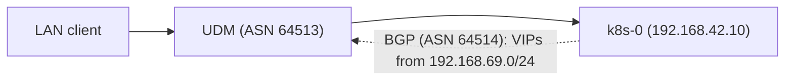
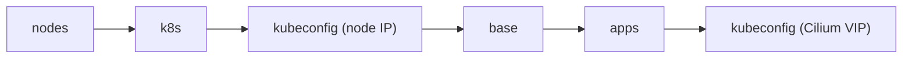

# Bootstrap

Everything needed to take freshly installed Talos nodes to a cluster that Flux
manages on its own. The entire process is driven by a single command:

```sh
just bootstrap cluster
```

Once it completes, Flux reconciles the rest of the repository and this
directory is not used again until the next rebuild.

## Prerequisites

- Tools pinned in `.mise/config.toml` installed via `mise install` (talosctl,
  just, minijinja-cli, op, yq, jq), plus kubectl, helm, helmfile, kustomize and
  gum on the PATH (not pinned here).
- A signed-in 1Password CLI (`op`). Machine secrets never live in this repo; every
  `op://` reference in the Talos configs and bootstrap manifests is resolved
  at apply time with `op inject`.
- A valid `talosconfig` at the repo root (mise points `TALOSCONFIG` there).
  The justfile derives the controller endpoint and node list from
  `talosctl config info`, so nothing is hardcoded here.
- The UDM configuration below. `k8s.internal` points at the Cilium
  LoadBalancer VIP, which exists only once Cilium is installed, so bootstrap
  talks to the controller's node IP directly until the `apps` stage brings
  Cilium up.

## UDM configuration

The Kubernetes API is fronted by a Cilium LoadBalancer Service (`kube-api`,
`192.168.69.120`, `externalTrafficPolicy: Local` so only nodes with a
healthy apiserver attract traffic). Cilium announces it to the UDM over BGP
along with every other LoadBalancer IP. See
[networking.yaml](../kubernetes/apps/kube-system/cilium/app/networking.yaml).



The VIPs the UDM learns this way:

| VIP              | Hostname                 | Backs                          |
| ---------------- | ------------------------ | ------------------------------ |
| `192.168.69.120` | `k8s.internal`           | `kube-api` Service (apiserver) |
| `192.168.69.121` | `internal.housefam.casa` | `envoy-internal` Gateway       |
| `192.168.69.126` | `external.housefam.casa` | `envoy-external` Gateway       |

A static A record in UniFi (under the policy settings; the UI location
varies by Network release) points the API hostname at the VIP:

```text
k8s.internal → 192.168.69.120
```

Cilium (ASN 64514) peers from the node IP on the SERVERS subnet
(`192.168.42.10`) and announces LoadBalancer Service IPs from the
`192.168.69.0/24` pool. UniFi accepts a single FRR config upload per device
(Settings → Routing → BGP):

<details>
<summary>FRR config</summary>

```text
router bgp 64513
  bgp router-id 192.168.1.1
  no bgp ebgp-requires-policy

  neighbor k8s peer-group
  neighbor k8s remote-as 64514

  neighbor 192.168.42.10 peer-group k8s

  address-family ipv4 unicast
    neighbor k8s next-hop-self
    neighbor k8s soft-reconfiguration inbound
  exit-address-family
exit
```

</details>

> [!WARNING]
> Re-uploading the FRR config briefly bounces established BGP sessions.

To verify: `vtysh -c "show bgp summary"` on the UDM should show the
`192.168.42.10` peer established, `vtysh -c "show ip route 192.168.69.120"`
should show the VIP routed through that node, and
`curl -k https://k8s.internal:6443/livez` should succeed.

No custom UDM boot scripts or kernel settings are required for this setup.

> [!NOTE]
> `k8s.internal` rides the Cilium `kube-api` LoadBalancer, so the named API
> endpoint depends on Cilium being healthy. If the CNI is ever down, reach
> the API directly at `https://192.168.42.10:6443` and the Talos API at the
> same node address; neither depends on the CNI.

## Stages

`just bootstrap cluster` runs these stages in order (see [mod.just](mod.just)):



1. **nodes** - Renders each node's Talos config (`talos/*.j2` templates plus
   1Password injection) and applies it with `talosctl apply-config --insecure`.
   Nodes that are already configured are skipped, so the stage is idempotent.
2. **k8s** - Runs `talosctl bootstrap` against the controller, retrying until
   etcd reports the cluster already exists.
3. **kubeconfig** - Fetches the kubeconfig with `talosctl kubeconfig`, then
   rewrites the server address to the controller's node IP: the generated
   `https://k8s.internal:6443` points at the Cilium VIP, which does not
   exist yet.
4. **base** - Waits for every control plane apiserver to answer `/readyz`
   and for nodes to register (they stay `Ready=False` until the CNI is
   installed), then applies:
    - `kustomize/` - bootstrap Secrets rendered through `op inject`, plus
      their namespaces: 1Password Connect credentials and token plus the
      Cloudflare tunnel ID (`personal/`). These exist before their
      controllers so nothing deadlocks on a missing Secret.
    - `helmfile/crds.yaml` - CRDs extracted from upstream charts
      (envoy-gateway, grafana-operator, kopiur, kube-prometheus-stack, and
      snapshot-controller) and applied directly. Installing CRDs out-of-band
      means Flux Kustomizations that consume CRD-backed resources don't need
      `dependsOn` chains.
5. **apps** - `helmfile sync` of `helmfile/apps.yaml`, the minimal release
   chain Flux needs before it can take over:

    cilium → coredns → cert-manager → external-secrets →
    onepassword-connect → flux-operator → flux-instance

    Once `flux-instance` is healthy, Flux reconciles `kubernetes/` and manages
    these same releases from then on.

6. **kubeconfig** - Re-fetches the kubeconfig so its endpoint returns to
   `https://k8s.internal:6443` once Cilium is serving the VIP.

> [!TIP]
> Every stage is safe to re-run. If bootstrap fails partway, fix the issue
> and run `just bootstrap cluster` again.

## Data restore (Kopiur)

Bootstrap itself restores no application data; that happens declaratively
once Flux takes over, via [Kopiur](https://github.com/home-operations/kopiur)
(deployed from [kubernetes/apps/kopiur-system/](../kubernetes/apps/kopiur-system/),
backed by the `s3` ClusterRepository: kopia in Cloudflare R2).

Apps that opt into the `kopiur/backup` component get a PVC whose
`spec.dataSourceRef` points at a Kopiur `Restore` with `target.populator: {}`
(see [kubernetes/components/kopiur/backup/](../kubernetes/components/kopiur/backup/)).
That makes the `Restore` a
passive volume-populator source: when Flux applies the app on a fresh
cluster, the PVC is provisioned by restoring the latest snapshot for the
app's SnapshotPolicy from the repository. The PVC stays unbound while the
restore mover Job runs, so the app's pod simply stays `Pending` until the
data is back; no restore-specific ordering is needed.

Because the `Restore`s use `onMissingSnapshot: Continue`, an app with no
snapshot yet (a brand-new app, or a deliberately fresh start) comes up with
an empty volume instead of failing; the same manifests handle first deploy
and disaster recovery ("deploy-or-restore").

Each `Restore` pins the snapshot it resolved on first reconciliation and
never silently retargets, even if a schedule fires mid-restore. Expect pods
to sit `Pending` for as long as their volume takes to restore.

## Single source of truth

The helmfiles define no chart versions or values of their own. Each release's
chart and version are read from the app's `ocirepository.yaml` and its values
from the app's `helmrelease.yaml` under `kubernetes/apps/` (see
[helmfile/templates/](helmfile/templates/)). Bootstrap therefore installs
exactly what Flux will
later reconcile, and Renovate updates only one place.
